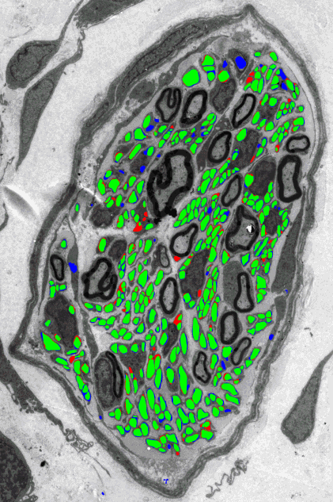

# Unmyelinated fiber segmentation

This is the official implementation of our *Scientific Reports* paper (2022):

**High-throughput segmentation of unmyelinated axons by deep learning**<br>
Emanuele Plebani, Natalia P. Biscola, Leif A. Havton, Bartek Rajwa, 
Abida Sanjana Shemonti, Deborah Jaffey, Terry Powley, Janet R. Keast, 
Kun-Han Lu & M. Murat Dundar

Abstract: *Axonal characterizations of connectomes in healthy and disease
phenotypes are surprisingly incomplete and biased because unmyelinated axons,
the most prevalent type of fibers in the nervous system, have largely been
ignored as their quantitative assessment quickly becomes unmanageable as the
number of axons increases. Herein, we introduce the first prototype of a
high-throughput processing pipeline for automated segmentation of unmyelinated
fibers. Our team has used transmission electron microscopy images of vagus and
pelvic nerves in rats. All unmyelinated axons in these images are individually
annotated and used as labeled data to train and validate a deep instance
segmentation network. We investigate the effect of different training
strategies on the overall segmentation accuracy of the network. We extensively
validate the segmentation algorithm as a stand-alone segmentation tool as well
as in an expert-in-the-loop hybrid segmentation setting with preliminary,
albeit remarkably encouraging results. Our algorithm achieves an instance-level
F1 score of between 0.7 and 0.9 on various test images in the stand-alone mode
and reduces expert annotation labor by 80% in the hybrid setting. We hope that
this new high-throughput segmentation pipeline will enable quick and accurate
characterization of unmyelinated fibers at scale and become instrumental in
significantly advancing our understanding of connectomes in both the peripheral
and the central nervous systems.*

[paper](https://www.nature.com/articles/s41598-022-04854-3) |
[project page](https://cs.iupui.edu/~mdundar/TEM_segmentation.htm)

## Introduction

We released a training and a test script for the automatic segmentation of
unmyelinated fibers in Transmission Electron Microscope (TEM) images.

Most of the literature on axon segmentation is focused on myelinated fibers,
for example [DeepAxonSeg](https://www.nature.com/articles/s41598-018-22181-4),
but unmyelinated fibers (UMFs) are far more common in TEM images. The
segmentation of UMFs is also more challenging, because they may have a wide
range of sizes and shapes, they are often clumped together, and other cell
elements (such as vesicles) may mimic the appearance of UMFs.

Our approach is based on a standard U-Net architecture, which is a convolutional
network with skip connections. We use four downsampling and upsampling stages,
with batch-normalization in each layer and dropout in the middle layers
(bottleneck). To achieve good performance, we use a border class and class
weights based on inverse class frequencies, to mimic a border-aware loss
function similar to the one proposed in the
[original U-Net paper](https://arxiv.org/abs/1505.04597). We also designed a
sampling strategy for the tiles fed to the model at training time, to boost the
accuracy on elongated and large fibers.

## Usage

`umf_train.m` is the training script. It takes a directory with a set of images
and annotated segmentation maps, divide them into tiles, and train a model.
The dataset directory is specified by the `datapath` variable at the start of
the script and the working directory, where the tiles and the trained model are
stored, is specified by the `out_dir` variable.

The training script expects the annotations images to be the outlines, in white
and one-pixel thick, of the unmyelinated fibers, saved as a TIFF image.
Available annotation tools, such as
[Neurolucida](https://www.mbfbioscience.com/neurolucida), can export the
annotations in such a format.

`umf_test.m` is the test script. It runs a trained model on a list of images
dividing each image into tiles spaced by 1/8 of the tile size.
The output for each image is a segmentation map both as a binary mask and
overlaid on the original image. Moreover, for each image, a set of metrics is
reported: the Panoptic Quality (PQ), Segmentation Quality (SQ), and Recognition
Quality (RQ) measures for instance segmentation
(see [Panoptic Segmentation](https://arxiv.org/abs/1801.00868)); the Dice
coefficient and the Jaccard index for pixel-level segmentation.

`panoptic_quality.m` is a standalone function that computes the Panoptic
Quality (PQ), the Segmentation Quality (SQ), and the Recognition Quality (RQ)
measures given the manual segmentation and the segmentation produced by the
model.

### Running example

We released two pretrained models: `unet_v1_published` used for the
experiments in the paper, and an improved version `unet_v2`, trained on a
larger (220k) set of tiles.
We also released a test image with annotated unmyelinated regions in a separate
image.
Download the images and the models from
[this link](https://cs.iupui.edu/~mdundar/TEM_segmentation/umf_release_data.zip)
and unzip the files in this directory.

To run the test script and get the segmentation
metric on the test image, run in Matlab (change the model name on line 5 to use
the `v2` model):

```bash
umf_test
```

You should get the following results for the two models:

| **Model** | **Image name**        | **PQ** | **SQ** | **RQ** | **Dice** | **Jaccard** |
| ----        | ----                     | ----    | ----  | ----  | ----   | ----     |
| **v1**     | `sub-131_sam-8_Image_em` | 0.646   | 0.784 | 0.824 | 0.866  | 0.764    |
| **v2**     | `sub-131_sam-8_Image_em` | 0.666   | 0.802 | 0.830 | 0.876  | 0.779    |

<br>
*Predictions for the `v1` model.*

## License

The code is released under the Apache-2 License (see `LICENSE.txt` for
details).

## Citation

If you find this repository useful in your research, please cite:

```bibtex
@Article{Plebani2022umf,
  author={Plebani, Emanuele and Biscola, Natalia P. and Havton, Leif A.
          and Rajwa, Bartek and Shemonti, Abida Sanjana and Jaffey, Deborah
          and Powley, Terry and Keast, Janet R. and Lu, Kun-Han
          and Dundar, M. Murat},
  title={High-throughput segmentation of unmyelinated axons by deep learning},
  journal={Scientific Reports},
  year={2022},
  month={Jan},
  day={24},
  volume={12},
  number={1},
  pages={1198},
  issn={2045-2322},
  doi={10.1038/s41598-022-04854-3}
}
```
