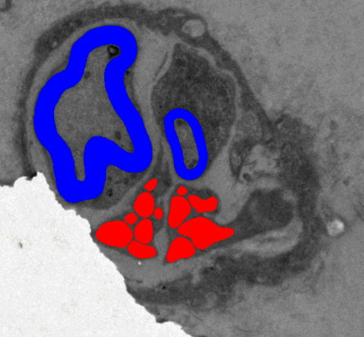
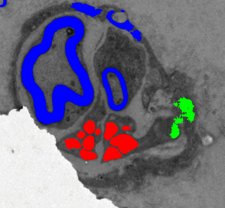

# Multi-class multi-resolution model

This folder contains an unpublished model for the segmentation of myelinated and
unmyelinated fibers and Schwann cell nuclei. The model is an ensemble of five
models trained on tiles at different scales, using a simplified network
architecture. The size of the ensemble is roughly the same (132) MB) as the
original U-Net model (120 MB), but it works better on a wider range of images.

## Ensemble model

This model is an improvement over the published U-Net model to mainly address
three issues:

- sensitivity to fascicle appearance and contrast
- false unmyelinated fiber detections inside myelinated fibers
- sensitivity to the average fiber size

To address the first issue, we use a modified version of the Cellpose model [1]
where the gradient prediction head is replaced by a semantic segmentation head.
The model is more robust to changes in appearance and contrast because it
computes a style vector from the image's features and uses it to modulate the
decoder. The model gives better results, especially on low-contrast and noisy
images.

To address the second issue, we train a multi-class model on the available
annotations, namely unmyelinated fibers (UMF), Schwann cell nuclei (SCN), and
myelinated fibers (UMF). The segmentation head also predicts a different border
class for each of the three classes, to help the model separate nearby fibers.
The model improves the results on UMF with good performance on SCN and MIF.

To address the third issue, we train an ensemble of five models with the same
architecture, on tiles at different scales, from 1× (full resolution) to 4×
downscaling in a geometric progression with step √2. Models at scale 1× and √2 
are trained using the full-resolution strategy; models at scale 2×, 2√2× and 4×
predict the three classes as separate channels of an RGB image with an L2 loss.
This strategy allows the model to predict pixels with partial coverage of the
fiber, which is important for small fibers.
The model reduces false positives ofr UMF and MF and it is more robust to
changes in the image resolution.

We released two versions of the model: the *default* ensemble does not use
histogram equalization for the last three models because it gives better
results in high-contrast and clean images.
The *histogram-equalized* ensemble instead uses histogram equalization for all
models, which gives better results on low-contrast and noisy images.

We apply the same post-processing steps as in the original U-Net model, namely
a morphological opening repeated five times unless two separate fibers are
merged, to compensate for the effect of the border class.
For the MF classes, we apply the opening only two times because the predictions
tend to be closer to the ground truth.

## Setup

The code is written in Python 3.8. Create a new conda environment and install
the dependencies with:

```bash
conda env create -f environment.yml
```

A GPU is not required to run the model, but it is recommended to speed up the
prediction.

We released the models and an additional example image on
[OneDrive](https://indiana-my.sharepoint.com/:u:/g/personal/eplebani_iu_edu/EVpn6uDAGHNOnMICv0uODOMBRuSW1Ss9MxmSFQAAHI4rtw?e=uSRTee);
download the archive and extract it in this folder.

## Usage

We released a prediction script that runs the ensemble on a list of images and
saves the results in the `prediction` directory. Run the script with:

```bash
python predict.py sam.tiff ../sub-131_sam-8_Image_em.tiff
```

The predictions are saved as a grayscale image with the following conventional
codes: 0 for the background, 255 for UMF, 60 for SCN, and 180 for MF.
The script also generates a color image with the predictions overlayed on the
original image using red for UMF, green for SCN, and blue for MF.
The script prints the elapsed time for each image and the time spent for
post-processing.

 &nbsp; 

*Predictions for the default ensemble model (left) and the single multi-class
model (right).*

You can use the `--raw` flag to save the results before the post-processing
steps and the `--out` argument to specify a different output directory.

With the `--model` flag you can specify the model to use: `ens` (default),
i.e., the default ensemble; `ens_he`, i.e., the histogram-equalized ensemble;
and `single`, i.e., the single model trained on the full resolution, for
comparison.

We also released a Jupyter notebook with an example of how to use the model
and visualize the results overlayed on the original image.

## References

- [1] Stringer, C., Wang, T., Michaelos, M. et al. Cellpose: a generalist
      algorithm for cellular segmentation. Nat Methods 18, 100–106 (2021). 
      https://doi.org/10.1038/s41592-020-01018-x
